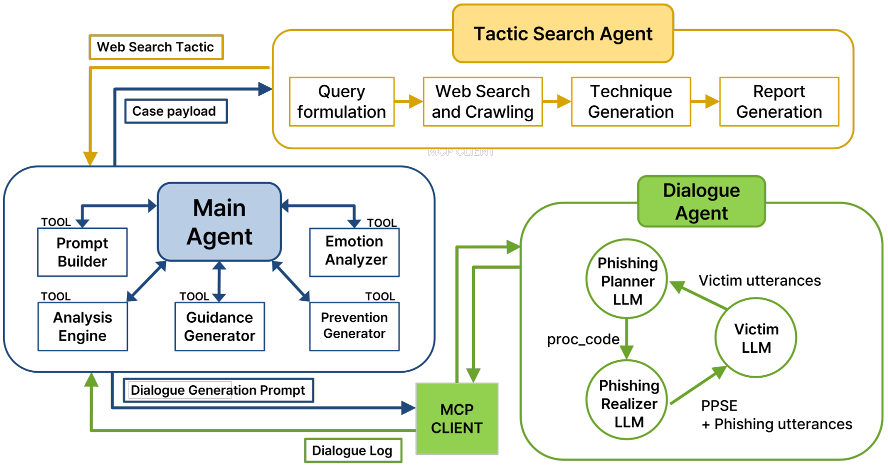
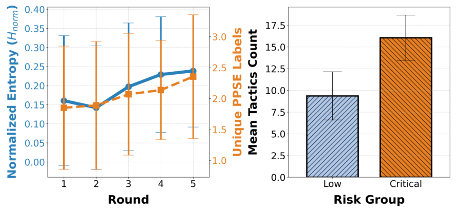
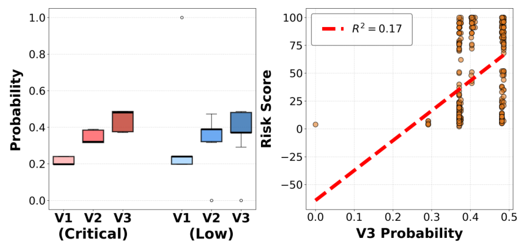
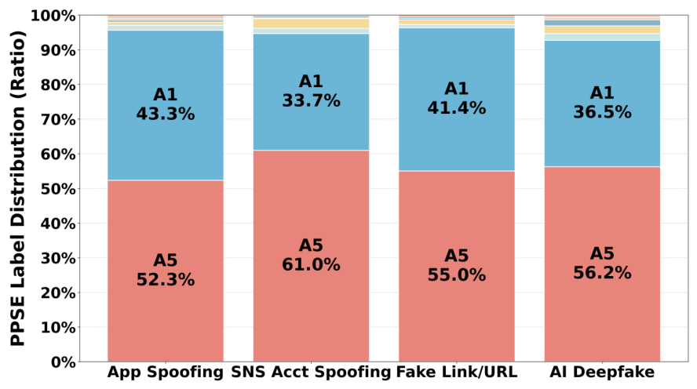

# VishBox v2: 적응형 보이스피싱 시뮬레이션 Multi-Agent 시스템

> **ACL 2026 Industry Track 게재 · Oral 발표 논문의 공식 구현체**
> 범죄 절차(crime script)와 설득 원칙에 근거해, 라운드마다 공격 전략과 피해자 심리가 함께 변하는 보이스피싱 대화를 생성합니다.

[](https://aclanthology.org/2026.acl-industry.145/)
[](https://aclanthology.org/2026.acl-industry.145/)

D. Choi\*, **Y. Yang**\*, Y. Hong, H. Kim, and S. Park,
"VishBox v2: A Multi-Agent System for Adaptive Voice Phishing Simulation,"
*ACL 2026 Industry Track*, pp. 2168–2180. (**\*공동 제1저자**)

한림대학교 소프트웨어학부 · 지능형의사결정시스템 연구실 (LIT LAB) · 경찰청 공동 연구

> 선행 연구 **VishBox v1** (IEEE Access, SCIE) → [yoonmo01/VP](https://github.com/yoonmo01/VP)

---

## 📌 v1에서 무엇이 달라졌나

v1은 "사람이 구분하지 못할 만큼 현실적인 대화"를 만드는 데 성공했습니다. 하지만 **왜 그 라운드에서 설득이 통했는지**는 설명하지 못했습니다. v2는 여기에 답하기 위해 구조를 다시 짰습니다.

| | **v1** (IEEE Access) | **v2** (ACL 2026) |
|---|---|---|
| **Agent 구성** | Manager Agent + 공격자·피해자 모델 | **Main Agent**가 **Dialogue Agent**와 **Tactic Search Agent**를 조율 |
| **공격자 설계** | 페르소나 프롬프트 기반 단일 생성 | **계획(planning)과 실현(realization) 분리** |
| **수법 근거** | 경찰청 범죄분석 보고서 | 위 + **PPSE 설득 원칙** + 수사 매뉴얼 **절차 코드(proc_code)** |
| **최신 수법 반영** | 없음 | **Tactic Search Agent**가 웹 검색으로 신종 수법 수집·요약 |
| **피해자 상태** | 턴 단위 확신도 점수 | 발화에서 **감정 신호 추출 → HMM 기반 잠재 취약 상태 추정** |
| **평가 단위** | 대화 전체 | **Turn / Round / Case** 3계층 정의 |
| **검증** | 참여자 102명 식별 실험 | **현직 경찰 3명** 절차 타당성 평가 |

---

## 🏗️ 시스템 구조

<p align="center">
  
</p>

Main Agent가 시뮬레이션 루프를 관리하고, 대화 생성은 MCP로 격리된 Dialogue Agent에, 신종 수법 수집은 Tactic Search Agent에 위임합니다.

```
                          ┌─────────────────────────┐
                          │      Main Agent         │
                          │  시뮬레이션 루프 관리     │
                          │  도구 호출 · 종료 판정    │
                          └───────┬────────┬────────┘
                    위임           │        │          확장 검색 결정
              ┌──────────────────┘        └──────────────────┐
              ▼                                              ▼
   ┌─────────────────────┐                      ┌──────────────────────┐
   │   Dialogue Agent    │                      │  Tactic Search Agent │
   │  ── MCP 격리 ──      │                      │  키워드 추출          │
   │  공격자 LLM          │                      │  웹 검색             │
   │  피해자 LLM          │                      │  수법 리포트 합성     │
   └──────────┬──────────┘                      └──────────┬───────────┘
              │ 발화 · 분석 신호                              │ 신종 수법
              ▼                                              ▼
   ┌────────────────────────────────────────────────────────────┐
   │  감정 추출 (KoELECTRA) → HMM 잠재 취약 상태 추정             │
   │  PPSE 설득 원칙 라벨링 · proc_code 절차 코드 정합성 검사      │
   └────────────────────────────────────────────────────────────┘
```

### Dialogue Agent의 MCP 격리

Dialogue Agent는 **Model Context Protocol(MCP)** 로 Main Agent와 분리됩니다. 민감한 대화 모델을 **온프레미스로 배포**하고 내부 리소스를 격리하기 위한 설계입니다. 공격자 생성은 **계획 단계와 실현 단계로 나뉘어** 수행됩니다.

### Tactic Search Agent

Main Agent가 확장 검색을 결정하면(케이스 내 **연속 2회 설득 실패**) 동작합니다. 키워드 추출 → 웹 검색 → 압축된 수법 리포트 합성 순으로 진행되며, 결과는 다음 라운드 공격 계획에 반영됩니다.

### 피해자 상태 추정

피해자 발화에서 감정 신호를 추출한 뒤(`HowRU-KoELECTRA`), **HMM 기반 추정기**로 겉으로 드러나지 않는 잠재 취약 상태를 추론합니다. 라운드에 걸친 심리적 위험 상승을 체계적으로 분석하기 위한 장치입니다.

### 평가 단위 정의

| 단위 | 정의 |
|---|---|
| **Turn** | 공격자 ↔ 피해자 1회 메시지 교환 |
| **Round** | 연속된 하나의 피싱 시도. 피해자가 명시적으로 거부하거나 고위험 행동이 관측되면 종료 |
| **Case** | 최상위 시뮬레이션 에피소드. **5개 라운드 완료** 또는 **`risk_level=Critical`**(송금·민감정보 제공 등 피싱 성공 확정) 시 종료 |

---

## 📊 검증 결과

**법 집행기관 사칭형**에 집중해 **181개 케이스 / 571 라운드**를 생성하고 분석했습니다.

### 1. 현직 경찰 전문가 평가 (3명, 5점 만점)

| 항목 | 점수 |
|---|---|
| **개연성 (plausibility)** | **4.43** |
| 현실성 (realism) | 4.11 |
| 다양성 (diversity) | 4.16 |

전문가들은 한계도 함께 지적했습니다. 표현이 반복되는 구간이 있고, 위협 강도가 실제보다 낮다는 점입니다.

### 2. 수법보다 절차상 위치가 중요하다

같은 수법이라도 4단계 범죄 스크립트의 어느 지점에 넣느냐에 따라 결과가 갈렸습니다.

| 절차 진행 패턴 | 성공률 |
|---|---|
| 단계 내 정교화 (`6-1 → 6-2 → 6-3`) | **73.8%** |
| 단계 건너뛰기 (`2-1 → 3-1 → 4-1`) | **4.9%** |
| 집계 기준 | **52.3%** vs **4.4%** |

출현 빈도가 비슷한 3-gram끼리 비교해도 이만큼 벌어집니다. 신뢰 구축을 건너뛰고 요구로 직행하면 거의 통하지 않습니다.

### 3. 고위험 라운드는 다양하지 않고 집요하다

<p align="center">
  
</p>

| 위험 수준 | 수법 다양성 (H<sub>norm</sub>) | 수법 밀도 |
|---|---|---|
| Low + Medium | 0.209 | 9.53 |
| **High + Critical** | **0.129** | **17.08** |

위험이 올라갈수록 **수법 종류는 줄고 같은 압박을 반복하는 밀도가 올라갑니다** (*p* < .001, Hedges' *g* = 1.30). PPSE 라벨도 **A5(압박·위협)** 와 **A1(권위)** 에 전체의 **93–96%** 가 몰립니다.

### 4. 공포보다 순응적 중립이 위험 신호다

<p align="center">
  
</p>

라운드별 감정 분포와 HMM이 추정한 잠재 취약 상태(V3 확률)의 상관을 봤습니다.

| 감정 | V3 확률과의 상관 |
|---|---|
| **중립** (순응적 중립) | **r = 0.519** |
| 공포 | r = 0.255 |

둘 다 *p* < .001입니다. **겁먹은 피해자보다 순순히 따르는 피해자가 더 위험**하다는 뜻으로, 공포 반응만으로 위험을 판정하면 놓치게 됩니다.

### 5. 웹 검색의 역설

<p align="center">
  
</p>

케이스 내에서 연속 2회 설득에 실패하면 웹 검색이 활성화됩니다.

| 웹 검색 | 라운드 | 성공 | 성공률 |
|---|---|---|---|
| ON | 164 | 18 | **10.98%** |
| OFF | 407 | 205 | **50.37%** |

최신 수법을 끌어온 라운드가 오히려 성공률이 낮습니다. 웹 검색이 **이미 설득이 막힌 어려운 상황에서만 켜지기 때문**이기도 하지만, 더 중요한 발견이 따로 있습니다.

공식 앱 사칭·가짜 URL·딥페이크 신원확인 같은 신종 수법을 **신뢰 구축 전에 투입하면 순응 대신 의심을 유발**합니다. "최신 수법을 아는 것"과 "그 수법이 통하는 것"은 다르며, 절차상 어느 위치에 넣느냐가 성패를 가릅니다. **v2의 핵심 기여입니다.**

---

## 🛠 기술 스택

| 계층 | 기술 |
|---|---|
| **Backend** | FastAPI · SQLAlchemy · Pydantic |
| **Agent** | MCP 서버 (`vp_mcp`) · ReAct 오케스트레이터 · 외부 웹서치 시스템 연동 |
| **감정 · 상태** | HowRU-KoELECTRA 감정 분류기 · HMM 취약 상태 추정기 (`app/services/emotion`, `app/services/hmm`) |
| **LLM** | GPT 계열 (공격자 · 피해자 · 관리자 · Agent 역할별 분리 설정) |
| **DB** | PostgreSQL |
| **Frontend** | React · Vite |
| **기타** | TTS 합성 · 관리자 요약 · 예방 가이던스 생성 |

> 논문 실험에서 공격자 모델은 GPT-4o-mini를 사용했습니다. 레포의 역할별 모델은 `.env`로 교체할 수 있습니다.

---

## 🚀 실행 방법

### 1. PostgreSQL 준비 (최초 1회)

**옵션 A. 로컬 설치**

```bash
# Linux (systemd)
sudo systemctl enable --now postgresql
sudo -u postgres psql -c "CREATE USER vpuser WITH PASSWORD '<비밀번호>';"
sudo -u postgres psql -c "CREATE DATABASE voicephish OWNER vpuser;"
```

```bash
# macOS (Homebrew)
brew services start postgresql
psql postgres -c "CREATE USER vpuser WITH PASSWORD '<비밀번호>';"
psql postgres -c "CREATE DATABASE voicephish OWNER vpuser;"
```

Windows: PostgreSQL 설치 후 *SQL Shell (psql)* 에서 위 SQL 두 줄을 실행합니다.

**옵션 B. Docker**

```bash
docker run -d --name vpsim-postgres \
  -e POSTGRES_USER=vpuser \
  -e POSTGRES_PASSWORD=<비밀번호> \
  -e POSTGRES_DB=voicephish \
  -p 5432:5432 \
  postgres:16
```

### 2. 환경변수 설정

`VP2/.env` 를 만들고 아래를 채웁니다. 프론트엔드는 별도 `.env`가 필요 없습니다.

```ini
# ── 데이터베이스 ────────────────────────
DATABASE_URL=postgresql+psycopg://<user>:<password>@127.0.0.1:5432/<db>?connect_timeout=5

# ── LLM 키 ─────────────────────────────
OPENAI_API_KEY=sk-xxxx
GOOGLE_API_KEY=AIza-xxxx          # 피해자 모델을 Gemini로 쓸 때만 필요

# ── 앱 ────────────────────────────────
APP_ENV=dev
API_PREFIX=/api

# 역할별 모델
ATTACKER_MODEL=gpt-4.1
VICTIM_MODEL=gemini-2.5-flash-lite
ADMIN_MODEL=gpt-4.1-mini
AGENT_MODEL=gpt-4.1-mini

# MCP 엔드포인트 (Dialogue Agent)
MCP_HTTP_URL=http://127.0.0.1:5177/mcp

# Tactic Search Agent (웹서치 시스템)
EXTERNAL_API_BASE_URL=http://127.0.0.1:8001

# (선택) 라운드/턴 제한
MAX_OFFENDER_TURNS=15
MAX_VICTIM_TURNS=15

# (선택) Gemini / GCP 자격 증명
GOOGLE_APPLICATION_CREDENTIALS=C:/path/to/your-credentials.json

# ── 감정 주입 ───────────────────────────
EMOTION_ENABLED=1                 # 1=ON, 0=OFF
EMOTION_PAIR_MODE=none            # none | prev_offender
EMOTION_MODEL_ID=LimYeri/HowRU-KoELECTRA-Emotion-Classifier
EMOTION_MAX_LENGTH=512
EMOTION_BATCH_SIZE=16
EMOTION_DEBUG_INPUT=1
```

> ⚠️ 실제 키·자격 증명 경로는 커밋하지 마세요. 공유 시에는 `.env.example`을 사용하세요.

<details>
<summary>백엔드 전용 오버라이드 (<code>app/.env</code>) (선택)</summary>

```ini
MCP_HTTP_URL=http://127.0.0.1:5177/mcp
EMOTION_PAIR_MODE=prev_offender
EMOTION_MODEL_ID=LimYeri/HowRU-KoELECTRA-Emotion-Classifier
EMOTION_MAX_LENGTH=512
EMOTION_BATCH_SIZE=16
EMOTION_DEBUG_INPUT=1
```

</details>

### 3. 실행

```bash
./run-local.sh
```

의존성 설치 → DB 시드 → 백엔드 · MCP 서버 · 프론트엔드 기동까지 한 번에 처리합니다.

| 대상 | 주소 |
|---|---|
| 프론트엔드 | http://localhost:5173 |
| 백엔드 API | http://127.0.0.1:8000 |
| API 문서 | http://127.0.0.1:8000/docs |
| MCP 서버 | http://127.0.0.1:5177/mcp |

<details>
<summary>개별 실행 (수동)</summary>

```bash
# 가상환경
python3 -m venv venv && source venv/bin/activate
# 또는: conda create -n vpsim python=3.11 && conda activate vpsim
pip install -r requirements.txt
python seed.py

# 백엔드
python -m uvicorn app.main:app --reload

# MCP 서버 (Dialogue Agent)
python -m uvicorn vp_mcp.mcp_server.server:app --reload --port 5177

# 프론트엔드
cd FE && npm install && npm run dev
```

</details>

<details>
<summary>문제 해결</summary>

```bash
# DB 연결 확인
sudo systemctl status postgresql
psql -h localhost -U vpuser -d voicephish

# 포트 충돌
netstat -tlnp | grep -E "(8000|5173|5177)"
pkill -f "uvicorn app.main:app"
pkill -f "vite --host 0.0.0.0"
```

</details>

---

## 📁 프로젝트 구조

```
VP2/
├── app/                                # FastAPI 백엔드
│   ├── core/                           # 설정 · 로깅
│   ├── db/                             # 모델 · 세션
│   ├── routers/                        # API 라우터 (react_agent, tts, victims ...)
│   ├── schemas/                        # Pydantic 스키마
│   ├── services/
│   │   ├── agent/                      # Main Agent 오케스트레이션
│   │   │   ├── orchestrator_mcp.py     #   Dialogue Agent(MCP) 연결
│   │   │   ├── orchestrator_react.py   #   ReAct 루프
│   │   │   ├── external_api.py         #   Tactic Search Agent 연동
│   │   │   ├── tools_emotion.py        #   감정 분석 도구
│   │   │   └── guidance_generator.py   #   예방 가이던스 생성
│   │   ├── emotion/
│   │   │   ├── howru_koelectra.py      #   감정 분류기
│   │   │   ├── emoti_shing_hmm.py      #   HMM 취약 상태 추정
│   │   │   ├── emotion_sequence.py     #   라운드별 감정 시퀀스
│   │   │   └── label_turns.py          #   턴 단위 라벨링
│   │   ├── hmm/runner.py               # HMM 실행기
│   │   └── prompt_builder.py           # 프롬프트 구성
│   └── utils/
├── vp_mcp/mcp_server/                  # MCP 서버 (Dialogue Agent 격리 환경)
├── FE/                                 # React 프론트엔드 (Vite)
├── scripts/                            # 데이터셋 추출 · 감정 라벨링 실행기
├── seeds/                              # 공격자 8 · 피해자 6 시드 데이터
├── tests/                              # 헬스체크 · 시뮬레이션 스텁
├── run-local.sh                        # 통합 실행 스크립트
├── run_cycle.py                        # 배치 시뮬레이션 러너
└── seed.py                             # DB 시드
```

---

## 📖 인용

```bibtex
@inproceedings{choi2026vishboxv2,
  title     = {VishBox v2: A Multi-Agent System for Adaptive Voice
               Phishing Simulation},
  author    = {Choi, Daon and Yang, Yoonmo and Hong, Yunyi and
               Kim, Heedou and Park, Sungmi},
  booktitle = {Proceedings of the 64th Annual Meeting of the Association
               for Computational Linguistics (Industry Track)},
  pages     = {2168--2180},
  year      = {2026},
  url       = {https://aclanthology.org/2026.acl-industry.145/}
}
```

관련 논문 (VishBox v1):

```bibtex
@article{yang2026vishbox,
  title   = {VishBox: An AI-Agent-Based Adaptive Voice Phishing Simulation
             Framework for Cybersecurity Education},
  author  = {Yang, Yoonmo and Choi, Daon and Hong, Yunyi and Park, Jee-Won
             and Yu, Jae-Yong and Kim, Hee-Dou and Park, Sungmi},
  journal = {IEEE Access},
  volume  = {14},
  pages   = {39672--39686},
  year    = {2026},
  doi     = {10.1109/ACCESS.2026.3667823}
}
```

---

## ⚖️ 윤리 및 라이선스

본 시스템은 **보안 교육과 방어 연구(red-teaming) 목적**으로만 제작되었습니다. 생성되는 대화는 전부 합성 데이터이며, 실제 피해자나 통화 녹취를 포함하지 않습니다. 실제 사기 행위에 활용하는 것을 금합니다.

논문은 **CC BY 4.0**으로 공개되어 있습니다. `docs/images/`의 그림은 해당 논문(Figure 1 · 2 · 3 · 4)에서 가져왔으며, 같은 라이선스를 따릅니다.
